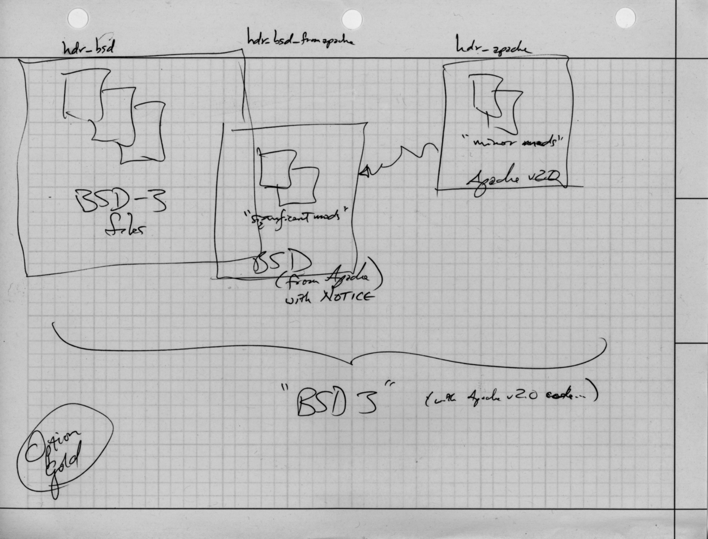
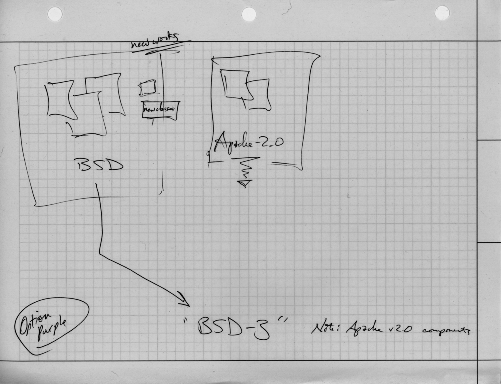

.. _licensingplan:

Licensing Plan
==============

This section represents guidance obtained from an initial conversation
in the Base Year with Peggy Hartman, and multiple conversations with
Fred Holt in 2015 and 2016.

Compatibility of Open Source Licenses
-------------------------------------

Wikipedia describes a `Permissive free software licence`_ (sic), which is a
concern when integrating open source projects.  Figure
:numref:`licensecompatibility` from this page is included here (under the terms of
Creative Commons "Attribution-Share Alike 3.0 License").

.. _licensecompatibility:

.. figure:: images/Floss-license-slide-image.png
   :alt: License compatibility between common FOSS software licenses according to David A. Wheeler (2007)
   :width: 70%
   :align: center

   License compatibility between common FOSS software licenses according to David A. Wheeler (2007)

..

.. _Permissive free software licence: https://en.wikipedia.org/wiki/Permissive_free_software_licence

.. _approvedLicense:

University approved release license
-----------------------------------

Initial guidance from Peggy Hartman indicated that University of Washington
preferred that software produced by the DIMS team be released under
the Berkeley Three-Part license (also known as *BSD-3*).  This is a simple
license that falls into the *permissive* category of open source licenses.

For a copy of the license, see Section :ref:`license`.

Considerations for release of DIMS project source code
------------------------------------------------------

.. attention::

    This subsection includes information obtained in conversations with Fred
    Holt, who has worked on intellectual property and technology transfer
    issues with the University of Washington Office of Technology Transfer.

    The principal issue that Fred Holt stressed in these conversations has
    to do with *compatibility* of licenses, and the use of open source software
    that was released under a *restrictive* license within a larger project
    whose source is released under a *permissive* license.

..

Software licenses work in two directions: Source code is released by the 
copyright holder, along with restrictions and permissions on how it is to
be used (or re-used); the recipient of open source software, wishing to
re-use it and build a new or derived work that they intend to release must
also choose a license under which their work is released, but must also
adhere to the restrictions and permissions of the work they are basing
their work upon. This raises issues of *compatibility* of terms in both
licenses that an open source development team needs to be aware of
and respect.

To understand the issues surrounding compatibility (or more importantly from a
legal perspective, **incompatibility**) of open source licenses, a little
history is necessary.  The GPL has over 20 years of history of controversy for
its terms and conditions.  Some of this controversy resulted in a slightly less
restrictive and narrower license known as the Lesser GPL (LGPL).

Part of the controversy over the GPL surrounds the time in which it came to
exist and the style of programming languages at the time that were heavily
slanted towards *compilation* and *linkage* (that is, writing *source code*,
running a *compiler* on the source code to produce *object files* and *object
libraries*, running a linker on the *object files and libraries* to produce an
*executable binary image* (also commonly called an *executable* or *EXE* file).
The GPL was targeted at these compiled executables, so if you used a
``Makefile`` (via the ``make`` command) to compile and link source code with
libraries released under the GPL, then under the spirit of the GPL's terms,
your program and its modules also had to be released under the GPL.

In today's programming environment, things are much more complicated. Languages
like Python act more like interpreters than compilers, though they do produce a
post-parsing form of binary code that helps speed execution by reducing
redundant parsing. Modules are imported into Python programs (often by loading
them into the directory hierarchy in which the Python interpreter stores its
own module source files).  Languages like Java similarly produce a *bytecode*
intermediary binary format file that is executed by a bytecode interpreter
known as the Java Virtual Machine (JVM), rather than being linked into a
stand-alone executable, with modules used by the program.

This is complicated further as a result of the Unix philosophy of programs
being simple and doing one thing very well, and those program being used with
pipelining and other execution invocation mechanisms to compose these simple
functions into higher-level more complex functionality, which can then be
further combined, and on and on. This raises questions like, "`Is a program
that forks a GPL-licensed program via a system or vice versa call derivative
work?`_" and -- specifically to the DIMS project, which uses Ansible -- "[Does]
the GPL license imply that my [Ansible] plugins are also GPL?" (see `Ansible
issue #8864`_) According to Holt and these commenters, simply using GPL code
does not always trigger the "derivative work" clause, but care must still
be taken to be clear about respect for the intent of these restrictive
licenses.

Abiding the Spirit of Restrictive Licenses
~~~~~~~~~~~~~~~~~~~~~~~~~~~~~~~~~~~~~~~~~~

Given the spirit of intent of the GPL, the following guidance will be applied
to DIMS code:

.. > So — [[ and these examples do not have clear boundaries ]] - 

* If source code is compiled and a GPL licensed module linked into it,
  then the resulting executable should be released under the GPL.

  .. note::

     The exception is the case where the GPL code may just facilitate
     one "layer" of a complex program, where the LGPL is more applicable.

  ..

* If we invoke a GPL program in a shell (even with arguments) then the other
  levels of the larger program, above and below the shell that invokes the
  GPL program, can be released under a different license (e.g. BSD-3)

  .. attention::

    While developing and integrating open source products, it is important to
    not only be aware of code released under GPL, but also look for a good
    boundary around GPL licensed code that respects the spirit of the license.

  ..

Implementing separation in source code
~~~~~~~~~~~~~~~~~~~~~~~~~~~~~~~~~~~~~~

Fred Holt described two options (*Gold* and *Purple*, two arbitrarily chosen
colors that have *nothing* to do with the University of Washington's school
colors) for handling licensing text and notification in source code repositories.

:numref:`sourceSeparationGold` (*Option Gold*) shows three different source
directories:

  * Left side: BSD Three-Part licensed code using a common header ``hdr_bsd``

  * Middle: "BSD (from Apache with notice)" using a common header ``hdr_bsd_from_apache``

  * Right side: Apache 2 licensed source code using a common header ``hdr_apache``

.. _sourceSeparationGold:

   'Option Gold' strategy for handling source code and selecting release license

..

This option is for dealing with primarily new BSD-3 code that relies in
part on Apache 2 source code that has been modified to some degree. The degree
to which is has been modified, while not a clear black-and-white determination,
informs whether the derived source should be released under the original
license of the source work (i.e., Apache 2), or under the desired Berkeley
Three-Part license.

* The middle section is for *significant mods* to the original code.  An
  example of a minor modification would be renaming variables to match naming
  conventions used in the DIMS project and changing values to brand the
  resulting run-time interfaces to match DIMS branding.

* The right section is for *minor mods* to the code.  A major modification
  would be fundamentally altering functions, classes, or adding substantial new
  code.

Either way, the original code is clearly identified as being distinct
from newly written code, the author of the code is acknowledged, and a
notice is included that the major work is derived from existing code
and the license under which that code was originally released.

:numref:`sourceSeparationPurple` (*Option Purple*) shows how Apache 2 licensed
code (kept separate on the right side of the figure) is included unmodified in
a separate directory that isolates it from DIMS code with BSD (kept separate on
the left). The *new works* code, for example sub-classes that inherit from
parent classes in the Apache 2 code base, are shown within the BSD box. The
repository is then released with the original license from the Apache 2 code
base and a note that the major work is BSD-3 that uses Apache 2 components
(along with references to where the code was originally obtained.)

.. _sourceSeparationPurple:

   'Option Purple' strategy for handling source code and selecting release license

..

.. _Is a program that forks a GPL-licensed program via a system or vice versa call derivative work?: http://www.ifross.org/en/program-forks-gpl-licensed-program-system-or-vice-versa-call-derivative-work
.. _Ansible issue #8864: https://github.com/ansible/ansible/issues/8864

