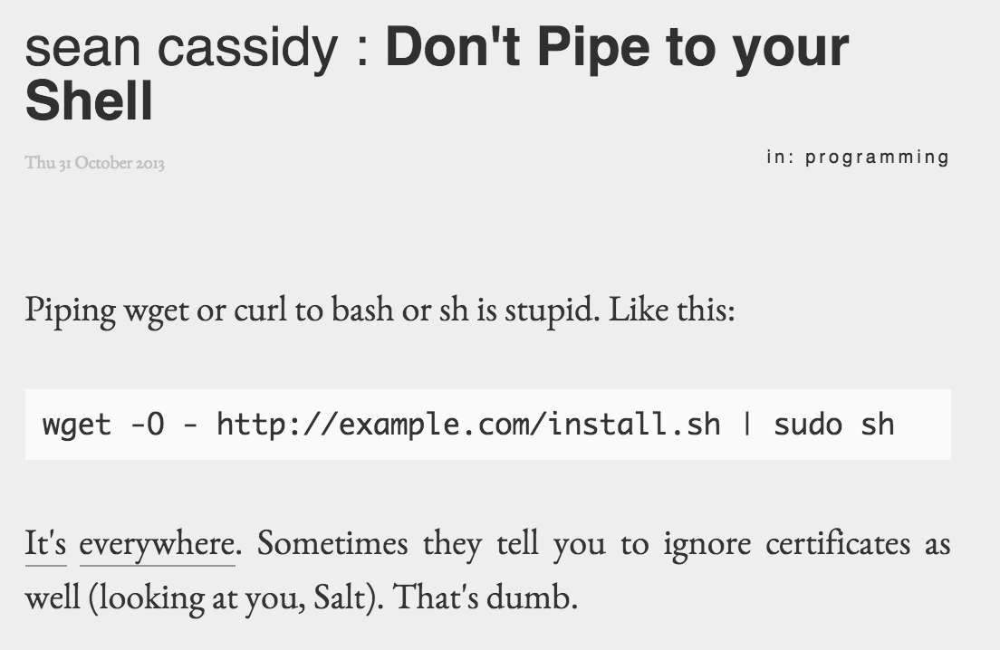
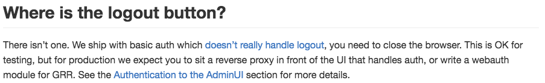
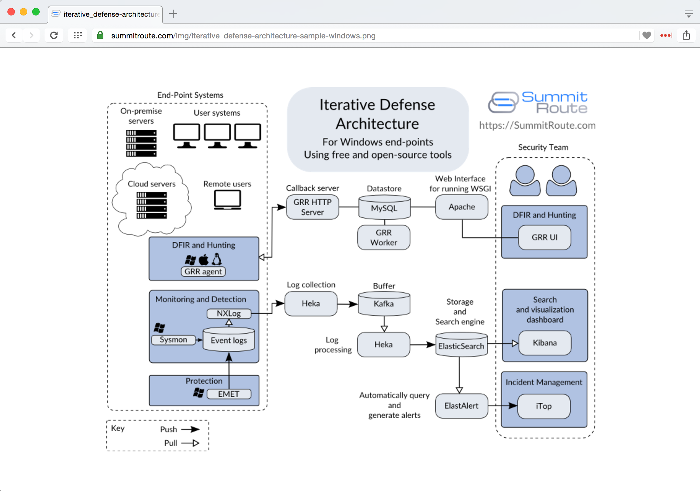
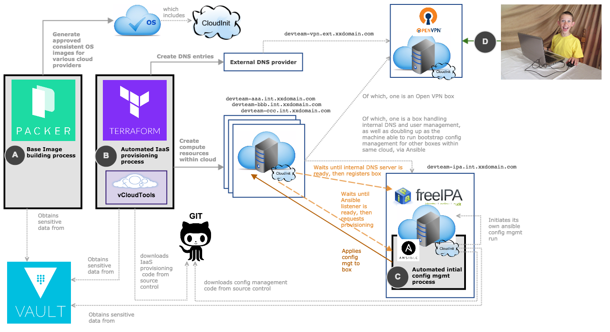

.. _valueproposition:

The Value Proposition
=====================

As mentioned in :ref:`introduction`, many of the products and services
available in today's enterprise cybersecurity market have too many zeros in
their total price. Nobody likes paying taxes, so local government can't
afford expensive products or managed security services. Volunteers developing
open source software don't want to give up both their time *and* the contents of
their savings accounts.

This section discusses the *value proposition* for the products of the
DIMS project.

The Need
--------

You can't have good system security without good system administration.
Organizations need to have strong system administration skills in order to have
a secure foundation for their operations. That 1/3 of attacks due to mistakes
and misconfigurations identified in Verizon's DBIR reflects a painful
reality. And 100% of those breaches occurred in companies who employ humans.

Seriously, all humans make mistakes, or miss things. Or they may not know
better when trying to just figure out how to get their job done and blindly
follow someone's lead, opening themselves and their organization up to a major
security hole (as seen in :numref:`curl2sudo` from `Don't Pipe to your
Shell`_).

.. _curl2sudo:

   Piping insecure content directly into a privileged shell

..

Mistakes are easier to make in situations where it is difficult to
see what is going on, or where someone is forced to deal with something
new that they have never dealt with before and have little expertise.
Paul Vixie has described the pain (in terms of operations cost and impact on
security posture) that results from *complexity* in today's distributed
systems and security products. [Vix16]_

.. pull-quote::

    *Increased complexity without corresponding increases in understanding
    would be a net loss to a buyer. [...]*

    *The TCO of new technology products and services, including
    security-related products and services, should be fudge-factored by at
    least 3X to account for the cost of reduced understanding. That extra 2X is
    a source of new spending: on training, on auditing, on staff growth and
    retention, on in-house integration.*

..

As knowledge and experience increase, the quality of work output increases and
the errors and omissions decrease.  Finding and procuring the talent necessary
to operate at the highest level, however, is neither easy, fast, nor cheap.

This all begs the question, "What can our organization do bring the
capabilities of multiple open source products into a functioning whole with the
least amount of pain and best operating security outcome?"

Our Approach
------------

Our approach is to provide a reference model for establishing a secure and
maintainable distributed open source platform that enables secure software
development and secure system operations. The DIMS team (now implementing the
third iteration of some of the core elements) has experienced the pain of this
process, which will reduce the cost for those who adopt our methodology.

The DIMS project brings together multiple free/libre open source software
(FOSS) tools in a reference model designed to be built securely from the ground
up.  The two primary outcomes of this effort are:

#. An example platform for building a complex integrated open source system for
   computer security incident response released as open source software and
   documentation.  These products provide a working and documented model
   platform (or DevOps infrastructure) that can facilitate the secure
   integration of open source components that (in and of themselves) are often
   hard to deploy, and often are so insecurely implemented that they are
   effectively wide open to the internet. This not only solves some of the
   infrastructure problems alluded to by the Linux Foundation, but also
   addressing Vixie's example of supporting organizations wanting to use open
   source security tools in concert to address their trusted information
   sharing and security operations needs.

#. Transitioning this platform into the public sector to support operational
   needs of State, Local, Territorial, and Tribal (SLTT) government entities.
   DIMS project outputs are being evaluated by the PISCES-NW not-for-profit
   organization for use in the Pacific Northwest (see Section :ref:`piscesnw`).
   The latest modification to the contract includes a pilot deployment for use
   by the United States Secret Service for their Electronic Crimes Task Force
   (ECTF) membership.

The :ref:`dimssr:dimssystemrequirements` documents security practices and
features that we have incorporated to the greatest extent possible, in a way
that can be improved over time in a modular manner. The system automation and
continuous integration/continuous deployment (CI/CD) features help in implementing and
maintaining a secure system. (Red team application penetration testing will
further improve the security of the system through feedback about weaknesses
and deficiencies that crept in during development and deployment.)

.. admonition:: Golden nugget

   Over two decades of system administration and security operations experience
   underlies the architectural model that we have been researching, developing,
   implementing, and documenting.  The barrier to entry is the amount of time
   and learning necessary to acquire this same expertise in order to be
   competitive.

..

.. _benefittocustomers:

Benefits per Cost
-----------------

The value of the DIMS products and methodology comes from altering the cost
equation described by Vixie, which can be expressed this way:

.. Disable because ReadTheDocs doesn't support imgmath. Use screen capture image instead.
.. .. math:: CustomerValue = \cfrac{CustomerBenefit}{cost(OpenSource) + cost(Implementation)}

..

The benefit to customers is maximized by the ability to construct and operate a
secure incident response monitoring platform, expand it with additional open
source tools as needed, saving a large part of the *2x* multiplier in
implementation cost in system administration and operations overhead cited by
Vixie. We enable this by helping make a less complex, more transparent, source
controlled, and easier to secure open source platform than may otherwise be
produced by someone leveraging multiple unfamiliar open source security tools
from scratch. That means standing up a new server and adding new services to
it can be reduced from taking hours or days per system to just a few minutes of
effort. If that task has to be repeated dozens (or possibly hundreds) of times,
the cost savings can be significant.

The DIMS team created and used a CI/CD model using `Git`_, `Jenkins CI`_,
and `Ansible`_
for taking software source code, system automation instructions, software
configuration, and documentation, to build a prototype for an open source
software integration project. The resulting product can be used by an internal
security operations group (or managed security service provider) to create an
open source incident response capability. It also provides many of the elements
called for in the CII `Badge Program`_ from the `GitHub Security`_ and `Heroku
Security`_ policies.

.. note::

    To see more detail about the full set of tools, techniques, and
    tasks that DIMS team members were expected to know or learn, see
    :ref:`dimsjds:dimsjobdescriptions`.

..

The impact of the effort expended in this project goes beyond implementing one
set of open source service components for a single group. This model can be
replicated widely and improved upon by others faced with the same set of
challenges in developing an affordable and scalable incident response
capability.

.. note::

    Over the course of the project, we have learned of several other efforts to
    address a similar set of goals and have reached out (as time permitted) to
    find common ground and try to develop collaborative relationships that will
    have broad impact over time. This is expanded upon in Section
    :ref:`commercializationplan`.

..

Competition and Alternatives
----------------------------

The common way that organizations go about implementing open source products is
by following whatever installation instructions may be provided by the authors.
Avoiding the security problems illustrated by :numref:`curl2sudo` involves
searching the Internet to (hopefully) find some thread like `Alternatives to
piping the install script into your shell. #90`_ (from GitHub
`fisherman/fisherman`_, a "plugin manager for Fish," and no, we haven't heard of
it before either.)

When it comes to the more difficult task of integrating multiple open source
products into a functional distributed system, the research required to debug
and solve an seemingly endless series of installation, configuration, and
tuning problems.

Open Source Security Toolsets
~~~~~~~~~~~~~~~~~~~~~~~~~~~~~

Some of the open source security tools that an incident response team would
want to consider implementing are covered in the following subsections.

Each of these systems is composed from several existing open source tools,
combined with new open source scaffolding, glue, custom interfaces,
and additional missing functionality that is necessary to achieve the
resulting distributed system.

At the same time, each of these distributed open source systems relies
upon their own chosen base operating system, libraries and languages,
subordinate services (e.g., database, email transport agent, message
bus, job scheduling, etc.) All too frequently, the choices made by
each group are mutually exclusive, or left to the customer to
work out on their own.

.. note::

    To underscore Vixie's complexity and cost of implementation
    observation, Ubuntu 14.04 and Debian 7 have differences in how common
    services are configured that require debugging and custom
    configuration steps that vary between distributions, while the use of
    ``systemd`` for managing service daemons in Ubuntu 16.04 and Debian 8
    are major impediments to migrating installation of all required
    components of these multi-service systems from Ubuntu 14.04 and
    Debian 7. Adding in RedHat Enterprise Linux, CentOS, or Fedora
    (all part of the same RedHat family) adds further complexity to
    the equation, which is a major reason why containerization is
    gaining popularity as a mechanism for isolating these dependency
    differences in a more manageable (but arguably less secure)
    fashion.

..

The Trident portal
^^^^^^^^^^^^^^^^^^

The Trident portal is written in Go. Only Debian 7 (wheezy) is supported
at this time, though Ubuntu 14.04 is on the list of future operating
systems. Trident relies on PostreSQL for database, NGINX for web
front end, and Postfix for email transport.

The Collective Intelligence Framework (CIF)
^^^^^^^^^^^^^^^^^^^^^^^^^^^^^^^^^^^^^^^^^^^

The `Collective Intelligence Framework`_ (CIF) is the primary offering from the
`CSIRT Gadgets Foundation`_. CIF is only supported on Ubuntu Linux. It is
written in Perl and uses PostgreSQL, Apache2, BIND, Elasticsearch, ZeroMQ,
and can support Kibana as an alternative interface to the indexed data
in Elasticsearch.

A monolithic *EasyButton* installation script is available in the
`PlatformUbuntu`_ section of the CIF wiki to automate the installation steps.

The Mozilla Defense Platform (MozDef)
^^^^^^^^^^^^^^^^^^^^^^^^^^^^^^^^^^^^^

The Mozilla Defense Platform (`MozDef`_) was developed by Mozilla to
replace a commercial SIEM product with open source alternatives. They
report processing over 300 Million records per day with their internal
deployment.

MozDef uses Ubuntu 14.04 as the base operating system. It has components for
front-end user interface written in Javascript using Meteor, Node.js, and d3,
and back-end data processing scripts written in Python using uWSGI, bottle.py,
with MongoDB for a database, RabbitMQ for message bus, and NGINX for web app
front end.

For installation, there is a demonstration ``Dockerfile`` for creating a
monolithic Docker image with all of the MozDef components in it.  (This is
not the way Docker containers are intended to implement scalable microservices,
but it does provide a very easy way to see a demonstration instance of MozDef).
The manual instructions are more elaborate and must be followed carefully
(including considering the admonitions related to security, e.g., "Configure
your security group to open the ports you need. Keep in mind that it's probably
a bad idea to have a public facing elasticsearch.")

GRR Rapid Response
^^^^^^^^^^^^^^^^^^

Another example of a system made up of multiple components, packaged together
into a single easy-to-install package, is the `GRR Rapid Response`_ system,
a "forensic framework focused on scalability enabling powerful analysis."

GRR runs on Ubuntu 16.04. To ease installation of the server components,
the GRR team, like CIF and MozDef, provide both a monolithic installation
script for a VM installation and a ``Dockerfile`` to run in a container.
They also have packages for installing the client components on Windows,
OS X, and Linux.

.. attention::

    The GRR team chose to move to ``systemd``, rather than continue to support
    the older ``upstart``, ``init.d``, or ``supervisord`` service daemon
    systems that are used by other products described in this section. This
    means you must support three (or four) different service daemon management
    mechanisms in order to incorporate all of the tools described here
    into a single integrated deployment.

..

GRR's documentation similarly includes admonitions about security and functionality
that is left to the customer to implement.  Take :numref:`grr-faq-logout`, a question
from their FAQ as an example:

.. _grr-faq-logout:

   Question about the logout button from GRR FAQ

..

Integrated Open Source Solutions
~~~~~~~~~~~~~~~~~~~~~~~~~~~~~~~~

The DIMS project began in Q4 2013. In the second half of 2015 two very similar
efforts were identified that use some of the same tools for the same reasons.
Both validate the model being established by DIMS and the value proposition
for adopters.

Summit Route Iterative Defense Architecture
^^^^^^^^^^^^^^^^^^^^^^^^^^^^^^^^^^^^^^^^^^^

An organization named `Summit Route`_ has described what they call the
`Iterative Defense Architecture`_ (see :numref:`summitrouteIDA`) that is very
similar in form and content to what the DIMS project has focused on producing.

.. _summitrouteIDA:

   Summit Route Integrated Defense Architecture

..

OpenCredo
^^^^^^^^^

A consultancy in the United Kingdom named `OpenCredo`_ is also working
on a similar architecture to the DIMS project (see :numref:`bootmygovcloud`).
Some of the specific components differ, but conceptually are the same
and would meet the same requirements for the foundation (minus the
dashboard, portal, etc.) that is specified in
:ref:`dimssr:dimssystemrequirements`.

.. _bootmygovcloud:

   OpenCredo core building blocks

..

.. References and footnotes follow.

.. _Don't Pipe to your Shell: https://www.seancassidy.me/dont-pipe-to-your-shell.html
.. _Badge Program: https://www.coreinfrastructure.org/programs/badge-program
.. _GitHub Security: https://help.github.com/articles/github-security/
.. _Heroku Security: https://www.heroku.com/policy/security
.. _Alternatives to piping the install script into your shell. #90: https://github.com/fisherman/fisherman/issues/90
.. _fisherman/fisherman: https://github.com/fisherman/fisherman
.. _Summit Route: https://summitroute.com
.. _Iterative Defense Architecture: https://summitroute.com/blog/2015/06/13/iterative_defense_architecture/
.. _OpenCredo: https://opencredo.com
.. _The journey towards a secure government cloud bootstrapping process: https://opencredo.com/boot-my-secure-government-cloud/
.. _Collective Intelligence Framework: http://code.google.com/p/collective-intelligence-framework/
.. _PlatformUbuntu: https://github.com/csirtgadgets/massive-octo-spice/wiki/PlatformUbuntu
.. _MozDef: http://mozdef.readthedocs.org/en/latest/
.. _Installation: http://mozdef.readthedocs.io/en/latest/installation.html#mozdef-manual-installation-process
.. _CSIRT Gadgets Foundation: http://csirtgadgets.org/rfc/getting-started/
.. _ELK stack: http://www.elasticsearch.org/overview/
.. _RabbitMQ: http://www.rabbitmq.com/
.. _GRR Rapid Response: https://github.com/google/grr
.. _Git: http://git-scm.com
.. _Jenkins CI: http://jenkins-ci.org/
.. _Ansible: http://www.ansible.com/get-started

.. [Vix16] Paul Vixie. Magical Thinking in Internet Security. https://www.farsightsecurity.com/Blog/20160428-vixie-magicalthinking/, April 2016.
